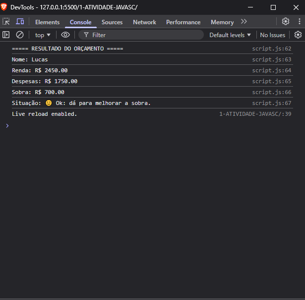

# 1-ATIVIDADE-JAVASC
# Simulador de Orçamento Pessoal

Aluno: João Vitor Ferreira Fernandes 
Matrícula: 928009 

## Descrição
Script em JavaScript que simula um controle simples de orçamento pessoal.

## Funcionalidades
- Entrada de dados com prompt()
- Validação com while
- Uso de for para despesas
- Decisão com if/else
- Saída com alert() e console.log()

## Execução
Abra o arquivo index.html no navegador e pressione F12 para ver o console.

## Print do resultado
